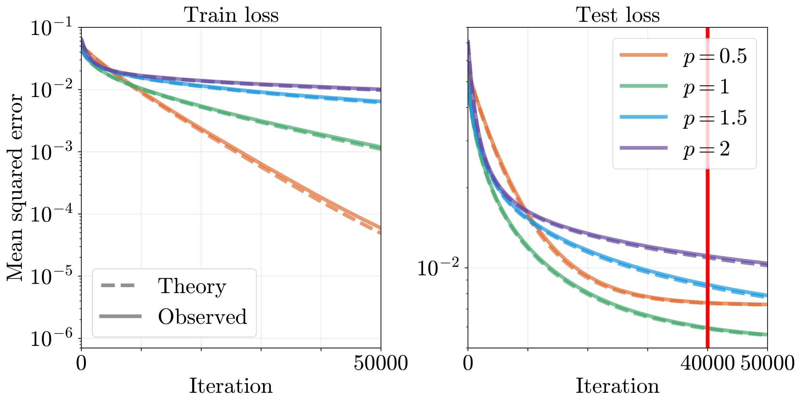
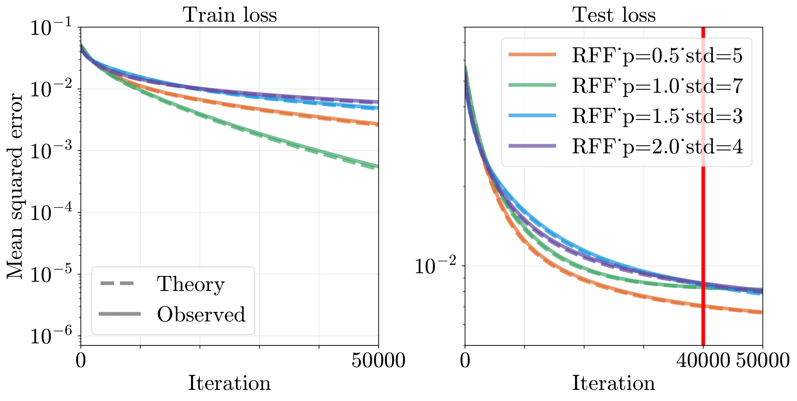
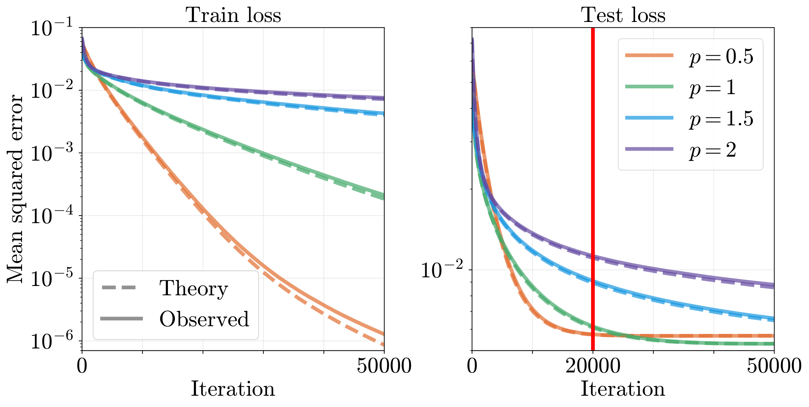

# Official Implementation for Sinusoidal Positional Encoding (SPE)

This is the Official Code for paper 

"Learning High-Frequency Functions Made Easy with Sinusoidal Positional Encoding". 

Chuanhao Sun, Zhihang Yuan, Kai Xu, Luo Mai, Siddharth N, Shuo Chen, Mahesh K. Marina.

This work has been published as a conference paper at **ICML 2024**

[Download Paper](https://arxiv.org/pdf/2407.09370)

## Code Example of SPE

```
class SPE(nn.Module):
    def __init__(self, input_dim, hidden_dim):
        super(SPE, self).__init__()
        ...
        ...
    def positional_encoding(self, x):
        ...

    def forward(self, x):
        # Apply positional encoding
        x = self.positional_encoding(x)

        # Apply fully connected layer
        x = self.fc(x)

        # Apply element-wise sin
        x = torch.sin(x)
        
        return x
```

This PyTorch code snippet shows how to implement `SPE`, showcasing the integration of a positional encoding layer based on the Fourier feature mappings discussed in ["Fourier Features Let Networks Learn High Frequency Functions in Low Dimensional Domains"](https://github.com/tancik/fourier-feature-networks/tree/master). The architecture comprises three key components: a positional encoding layer for input transformation, a fully connected layer, and an element-wise sine function laye (For details, please refer to our paper).

## Project Structure Explanation

- `README.md`: Contains the project overview, the main reasults for our proposed SPE on three main experimented use cases: 1) 1-D regression, 2) 2-D speech synthesis and 3) 3-D NeRF.
- `imgs/`: Lists the results plot for to be displayed in this page (`README.md`). You can see all the main results plots displayed in this `README.md`.
- `codes/`: This is the main directory for illustration of our experiments with SPE.
  - `1d_regression/`: This directory contains all experiments and results for 1-D regression use case.
  - `2d_text2speech/`: This directory contains all experiments and results for 2-D Text to Speech use case.
  - `3d_NeRF/`: This directory contains all experiments and results for 3-D NeRF use case.

## Usecases

We conducted extensive use case evaluations including 1) 1-D regression, 2) 2-D speech synthesis and 3) 3-D NeRF.
The implmentations and results of baseline comparison are listed in `./codes` folder.

### 1-D regression

The detailed code illustration can be found in `./codes/1d_regression`.

We implement the 1d regression task with SPE. See the implementation of ["Fourier Features Let Networks Learn High Frequency Functions in Low Dimensional Domains"](https://github.com/tancik/fourier-feature-networks/tree/master).

<p align="center">
  
  <br>
  <em>Fig: Loss plots for 1-d regression task using original PE.</em>
</p>

<p align="center">
  
  <br>
  <em>Fig: Loss plots for 1-d regression task using Gaussian Random Fourier Features (Gaussian RFF).</em>
</p>

<p align="center">
  
  <br>
  <em>Fig: Loss plots for 1-d regression task using our proposed SPE.</em>
</p>

### 2-D Text2Speech Generation 

The detailed code illustration can be found in `./codes/2d_text2speech`.
(Under Restructuring)

We implement the SPE with FastSpeech, where the full connection layers perform a bottleneck when generating more details of the speech signal. See the implementation of ["FastSpeech"](https://github.com/xcmyz/FastSpeech)


The gain is reflected on different fidelity metrics as well.


### 3-D NeRF

The detailed code illustration can be found in `./codes/3d_NeRF`.
(Under Restructuring)

We implement the SPE with FreeNeRF and achieve the state-of-the-art performance on few-view NeRF fidelity. See the implementation of ["FreeNeRF"](https://github.com/Jiawei-Yang/FreeNeRF)

The modification we made is illustrated in the following figure:


And for the first time, we managed to explain why the Basic NeRF takes 10 components on Blender dataset by learning the frequency features directly.


Our model achieves SOTA performance on few-view NeRF tasks


Compared with different SOTA NeRF method with different encoding methods, the SPE shows stable gain that depends on the exact implementation of NeRF method. The fidelity is shown in the following table.


