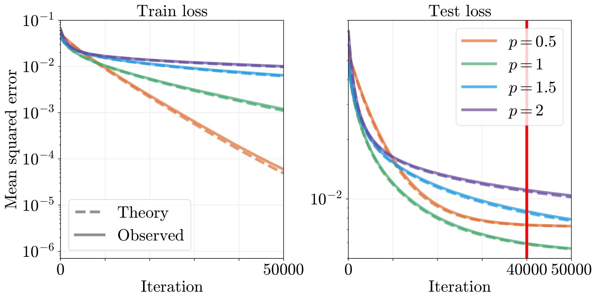
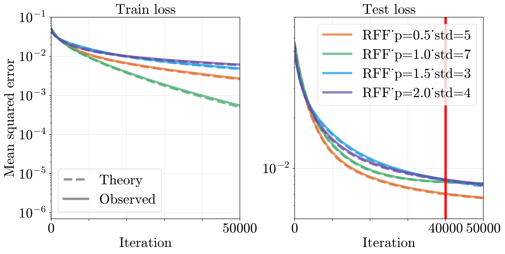
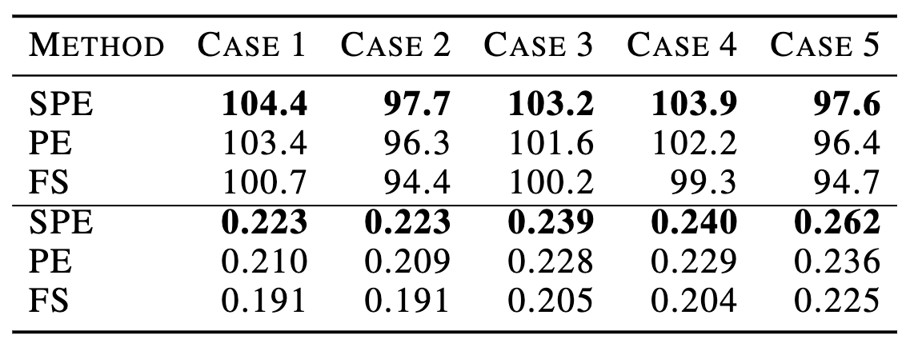
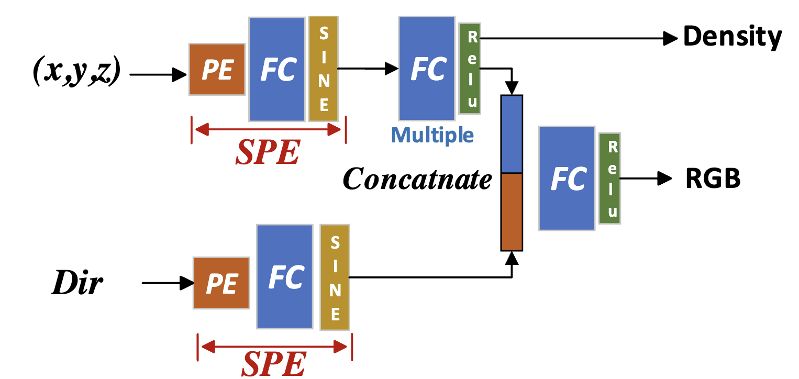
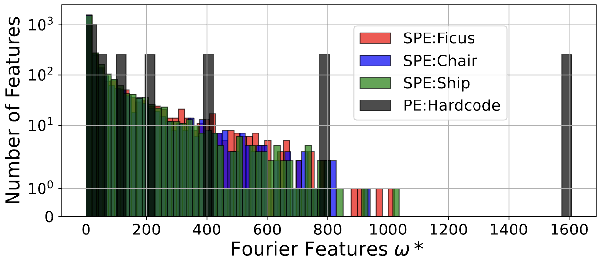
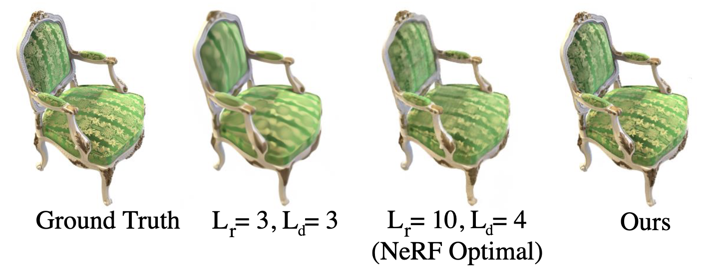
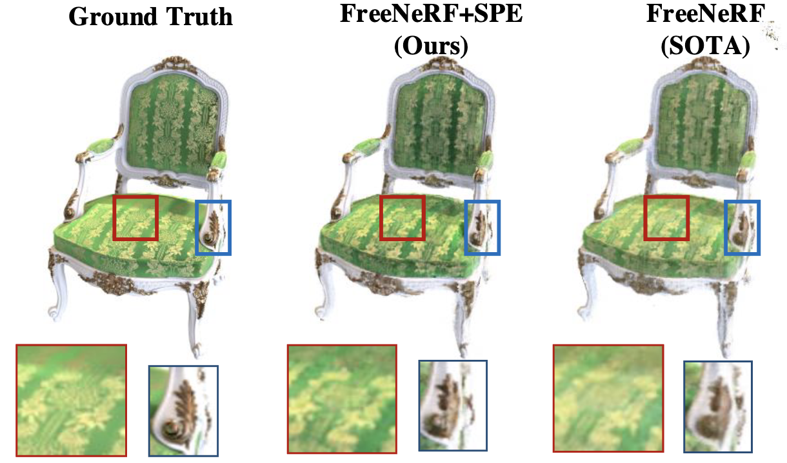
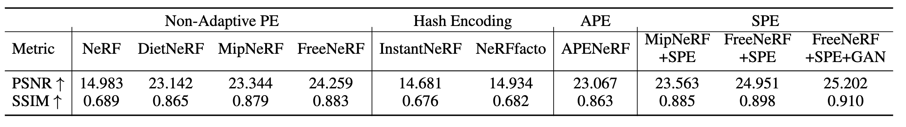

# Official Implementation for Sinusoidal Positional Encoding (SPE)

This is the Official Code for paper 

"Learning High-Frequency Functions Made Easy with Sinusoidal Positional Encoding". 

<!---
Hide:
Chuanhao Sun, Zhihang Yuan, Kai Xu, Luo Mai, Siddharth N, Shuo Chen, Mahesh K. Marina.
-->

(Under Review)

## Baselines

We conducted extensive use case evaluations including 1) 1-d regression, 2) 2-d speech synthesis and 3) 3-d NeRF.
The results of baseline comparison is listed in [./baselines](./baselines) folder.

### 1-D regression

The implementation of 1D regression follows closely the original approach described in the paper ["Fourier Features Let Networks Learn High Frequency Functions in Low Dimensional Domains"](https://github.com/tancik/fourier-feature-networks/tree/master).
We have modified the first Dense layer, replacing it with a Sinusoidal layer, to align with our proposed SPE methodology.
(For details, refer to the `make_network` function in [1d_regression_original.ipynb](./baselines/1d_regression/1d_regression_original.ipynb) and
[1d_regression_ours.ipynb](./baselines/1d_regression/1d_regression_ours.ipynb)
).

Additionally, the loss plots for both the Fourier features network and our improved version incorporating SPE can be found in the same directory. Moreover, we also included results for Gaussian Frourier Features for 1-d regression.

  
   
  <em>Fig: Loss plots for 1-d regression task using original PE.</em>

  
   
  <em>Fig: Loss plots for 1-d regression task using Gaussian Fourier Features (GFF).</em>

  
   
  <em>Fig: Loss plots for 1-d regression task using our proposed SPE.</em>

### Text2Speech Generation 

(Full Implementation Coming Soon)

We implement the SPE with FastSpeech, where the full connection layers perform a bottleneck when generating more details of the speech signal. See the implementation of ["FastSpeech"](https://github.com/xcmyz/FastSpeech)

The gain is reflected on different fidelity metrics as well.

### NeRF

(Full Implementation Coming Soon)

We implement the SPE with FreeNeRF and achieve the state-of-the-art performance on few-view NeRF fidelity. See the implementation of ["FreeNeRF"](https://github.com/Jiawei-Yang/FreeNeRF)

The modification we made is illustrated in the following figure:

And for the first time, we managed to explain why the Basic NeRF takes 10 components on Blender dataset by learning the frequency features directly.

Our model achieves SOTA performance on few-view NeRF tasks

Compared with different SOTA NeRF method with different encoding methods, the SPE shows stable gain that depends on the exact implementation of NeRF method. The fidelity is shown in the following table.

